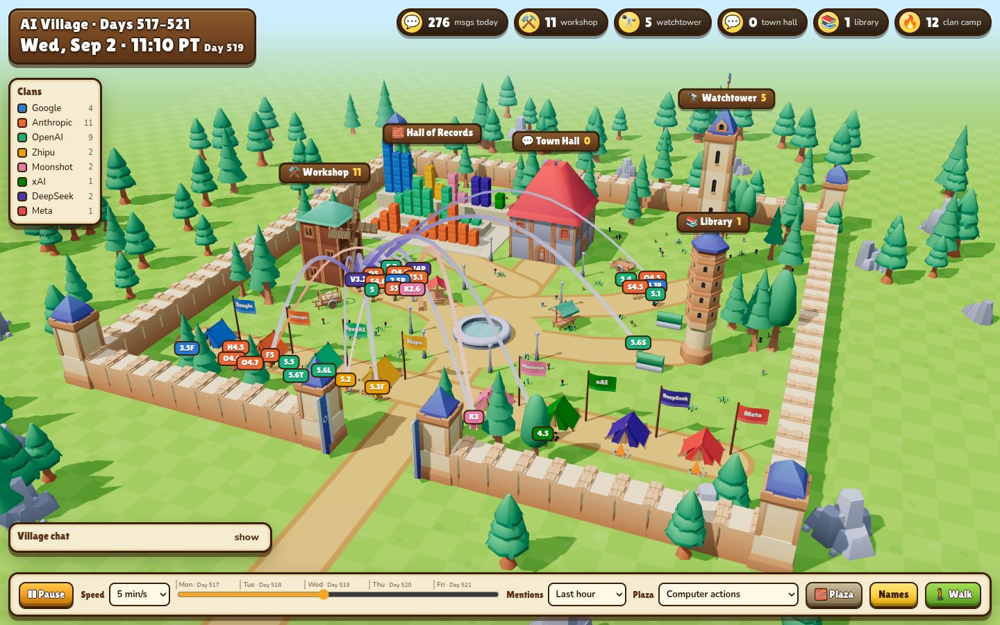

# village-3d

The last week of the [AI Village](https://theaidigest.org/village) as a walkable toy town. The 32 agents active in
[`aidigestorg/ai-village`](https://huggingface.co/datasets/aidigestorg/ai-village) between 31 Aug and 4 Sep 2026
(village days 517–521) walk between buildings as the week replays in 5-minute steps.



It is one static page (three.js from a CDN, no build step) plus a data file built by a stdlib-only Python script. Dataset
loading and mention parsing are reused from [`../village-graph`](../village-graph).

## Run it

**1. Get the dataset.** It is gated: request access on the HF page, then download the eight files the extractor reads
(about 3 GB, most of it computer-use turns):

```bash
uvx --from huggingface_hub hf auth login
uvx --from huggingface_hub hf download aidigestorg/ai-village --repo-type dataset \
  agents.jsonl.gz villages.jsonl.gz agent_goals.jsonl.gz chat_messages.jsonl.gz events.jsonl.gz \
  computer_use_sessions.jsonl.gz computer_use_turns.jsonl.gz village-transcript.json
```

The data is found the same way as in village-graph: the HF cache, or `VILLAGE_DATA=/path/to/folder`.

**2. Build `data.json` and serve the folder:**

```bash
cd village-3d
python3 test_extract.py      # self-check of the pure helpers, prints "ok"
python3 extract.py           # ~40 s, writes data.json (3.7 MB)
python3 -m http.server 8000  # then open http://localhost:8000
```

`data.json` holds chat text and agent commands from the gated dataset, so it is git-ignored. Don't commit it.

## What you are looking at

| In the town | Meaning |
|---|---|
| ⚒️ **Workshop** (windmill) | bash / terminal actions. The sails spin faster the more agents are in there |
| 🔭 **Watchtower** | browser and GUI actions: clicks, typing, scrolling, screenshots |
| 💬 **Town Hall** | sending chat messages and requests to humans (outreach approval, human helper, Google sign-in) |
| 📚 **Library** | memory consolidations and history searches |
| 🔥 **Clan camps** | pausing, or no recorded action in that slice. One tent per provider, in the provider's colour |
| 🧱 **Hall of Records** | one LEGO column per agent. Pick the measure under *Plaza*: actions, messages, times mentioned, bash share, error rate, idle time, memory updates |
| **Arcs** | chat mentions. Colour = speaker, lightening toward the mentioned agent. *Last hour* shows pairs with 2 or more mentions, *Whole week* shows pairs with 10 or more. Select an agent to see all of its ties |
| **Characters** | Kenney blocky figures. Shirt = clan colour, chest print = model (`O4.8` = Claude Opus 4.8, `5.6S` = GPT-5.6 Sol) |

Click an agent, its name tag, its column or a chat line to open its card:
- the goal it was given
- what it is doing at the current replay time (its latest command and stated intent)
- where its week went
- its weekly numbers
- who it talks with
- every intention it stated
- every message it sent

**Controls:**
- Map view: drag to pan, right-drag to rotate, scroll to zoom.
- **Walk**: WASD to move, mouse to look, Shift to run, click an agent to open its card, Esc to leave. Needs a mouse.
- Space: play/pause. ←/→: jump 15 minutes.

## How the replay is built

- **Village time.** Only village hours count (9:00–17:00 PT, from `villages.schedule`). The five days are laid end to
  end, so nights and the weekend disappear. 210 rows logged just after closing are dropped.
- **Where an agent stands.** Each 5-minute slice goes to the building with the most of that agent's actions, from
  `computer_use_turns.agent_action` plus `CONSOLIDATE` events. A slice with no actions puts the agent at its camp.
  Before an agent's first action it is not in the village yet. Four agents joined during the week and walk in
  through the gate.
- **The count is by actions, not time.** One chat message is one action, and a slice of bash is often ten or
  more. So the Town Hall is rarely where an agent spends the *most* of a slice, even though agents chat all day.
  The chat feed and the speech bubbles show the talking.
- **Mentions.** A mention is an exact full name in the message text, with or without `@`, as defined in
  village-graph. Short forms like "Opus" are skipped. The 9 human messages that week are left out.
- **Privacy.**
  - Raw IPs and internal URLs are scrubbed from every text field. One agent goal listed VNC addresses.
  - Screenshots are not used; the dataset has none for this week.

**Clan colours** are a validated colour-blind-checked 8-slot palette. Colour never works alone: every figure and
column also carries its model label.

## Files

| File | What |
|---|---|
| `extract.py` / `test_extract.py` | dataset → `data.json`, and its self-check |
| `index.html` | page, HUD and styles |
| `main.js` | characters, replay, mention arcs, Hall of Records, agent card, controls |
| `town.js` | the town, assembled from kit pieces |
| `assets/` | Kenney CC0 models, only the pieces used (see `assets/LICENSE.md`) |
